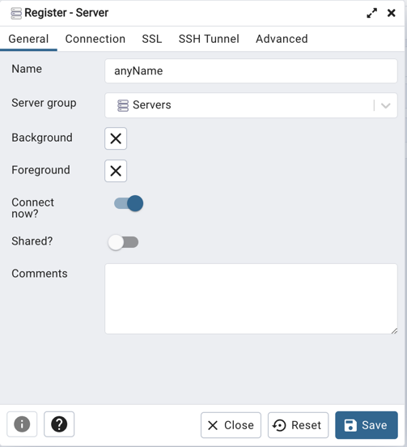
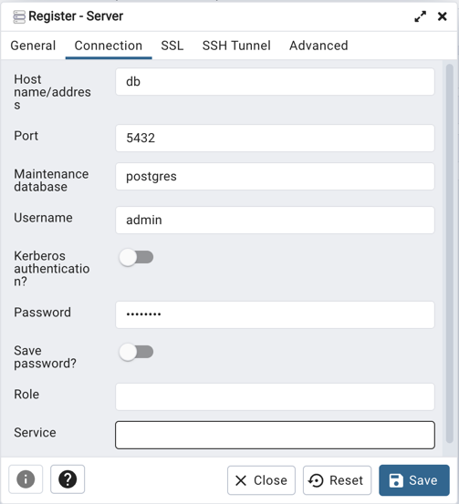

# Recipes Api

## Technologies
- Spring boot 
- Spring security
- JUnit and Mockito
- PostgreSQL
- Docker
- OpenAPI docs and SwaggerUI

## Getting started
1. Open terminal
2. Clone the repository `git clone git@github.com:Wonderpol/RecipesRestApi.git`
3. Go to the project directory
4. Build the project `./gradlew clean build`
5. Run the app and database `docker compose up`

**Appendix**

If you want to use pgadmin4 (which is a tool to easily administrate the database) 
you have to uncomment pgadmin4 service in docker-compose like so:

`vim docker-compose.yml`

```yaml
#  pgadmin:
#    image: dpage/pgadmin4
#    container_name: pgadmin4_container
#    restart: always
#    ports:
#      - "5050:80"
#    environment:
#      PGADMIN_DEFAULT_EMAIL: test@test.com
#      PGADMIN_DEFAULT_PASSWORD: admin12345678
```

Press `i` to switch to insert mode and remove all the `#` 
then press `esc` and type `:wq` to save and quit

If you've done everything good the `docker-compose` file should be:

```yaml
version: '3.8'

services:
  app:
    image: 'recipes-api:latest'
    build:
      context: .
    container_name: app
    depends_on:
      - db
    ports:
      - '8080:8080'

  db:
    image: 'postgres:13.1-alpine'
    container_name: db
    ports:
      - '5432:5432'
    environment:
      - POSTGRES_USER=admin
      - POSTGRES_PASSWORD=password
      - POSTGRES_DB=recipes

  pgadmin:
    image: dpage/pgadmin4
    container_name: pgadmin4_container
    restart: always
    ports:
      - "5050:80"
    environment:
      PGADMIN_DEFAULT_EMAIL: test@test.com
      PGADMIN_DEFAULT_PASSWORD: admin12345678
```

No you can stop the container `docker copose down` and run it again `docker compose up`

Now admin panel of the database is available at: http://localhost:5050
Your login credentials are located in `docker-compose.yml` feel free to edit them: 
```yaml
PGADMIN_DEFAULT_EMAIL: test@test.com
PGADMIN_DEFAULT_PASSWORD: admin12345678
```

To access your database right click on `Servers` and  `Register->Server` 



Name property can be chosen by you, and it doesn't depend on any configuration, then go to `Connection` tab.



Set Host name/address, Username, Password properties and click `Save`.
All of this are defined in `docker-compose.yml` file.

## Api endpoints

### Swagger documentation 
Swagger ui documentation is available at: <http://localhost:8080/swagger-doc>

### Rest endpoints

**/api/v1/recipe**
- `GET` : Get all recipes
- `POST` : Add new recipe (user must be authenticated)

**/api/v1/recipe/:id**
- `GET` : Get recipe by id
- `PUT` : Edit recipe
- `DELETE` : Delete recipe

**/api/v1/recipe/search/?category=:category**
- `GET` : Get list of recipes with matching category
Example of usage:
 - `GET` : `http://127.0.0.1:8080/api/v1/recipe/search/?category=soup` - will get all recipes with category soup

**/api/v1/recipe/search/?name=:name**
- `GET` : Get list of recipes with matching name
Example of usage:
- `GET` : `http://127.0.0.1:8080/api/v1/recipe/search/?name=Carroten` - will get all recipes that name contains `Carroten`

**/api/v1/recipe/my**
- `GET` : Get list of authenticated user's recipes

### TODO
- [ ] Add authentication documentation
- [ ] Add integration test
- [ ] Deploy on aws